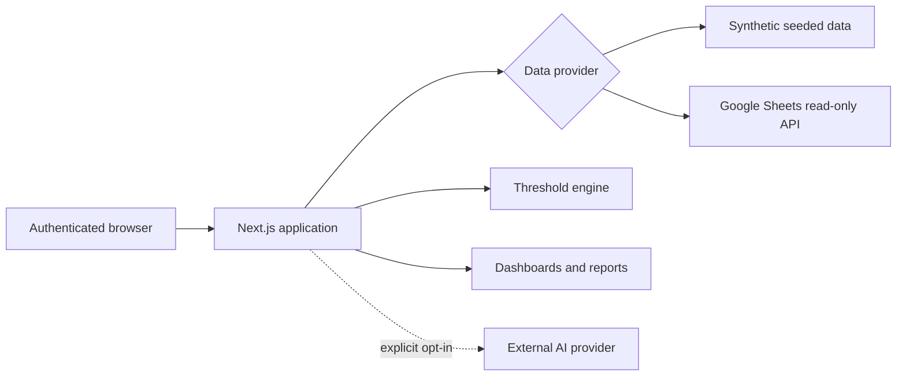

<div align="center">

# AdPilot Elite Community

**A security-first Meta Ads command center for agencies and multi-brand teams.**

[](https://github.com/justinalejandro369-star/adpilot-elite-community/actions/workflows/ci.yml)
[](https://github.com/justinalejandro369-star/adpilot-elite-community/actions/workflows/codeql.yml)
[](LICENSE)
[](https://nextjs.org/)
[](https://www.typescriptlang.org/)

[Getting started](#quick-start) · [Security](SECURITY.md) · [Contributing](CONTRIBUTING.md) · [Deployment](docs/deploy-guide.md)

</div>

AdPilot Elite turns fragmented campaign data into an operator-friendly workspace: executive KPIs, campaign diagnostics, alerting, attribution views, content planning, and an optional AI copilot. The community edition starts with deterministic synthetic data, so anyone can explore the product without connecting an ad account or exposing a client.

> [!IMPORTANT]
> This repository is a sanitized community snapshot. It contains no production credentials, private client configuration, advertising account IDs, or real campaign exports. Do not copy secrets or tenant files into Git.

## Why AdPilot Elite

- **One operational view** — compare spend, CTR, CPC, frequency, purchases, leads, and ROAS across clients.
- **Actionable diagnostics** — surface budget waste, fatigue, weak CTR, high CPC, and high-performing campaigns.
- **Agency-ready structure** — multi-client navigation, currencies, time zones, configurable thresholds, and white-label portal views.
- **Safe demo mode** — seeded mock data and synthetic brands make local evaluation reproducible.
- **Extensible data layer** — use the built-in mock provider or a read-only Google Sheets service account.
- **Modern product stack** — Next.js App Router, React, TypeScript, Tailwind CSS, Recharts, and Playwright.

## Security defaults

The public version deliberately fails closed:

| Control | Default |
| --- | --- |
| Built-in credentials | No fallback username or password |
| Data source | Synthetic `mock` provider |
| Client configuration | Tracked synthetic example only |
| Client portals | Disabled |
| AI copilot / third-party data transfer | Disabled |
| Google Sheets access | Read-only scope |
| Secret and private-key files | Gitignored and scanned in CI |

The bundled credentials provider is intended for evaluation and small internal deployments. Use an established identity provider and per-tenant authorization before serving multiple organizations in production.

## Quick start

### Prerequisites

- Node.js 20 or newer
- npm 10 or newer

### Install

```bash
git clone https://github.com/justinalejandro369-star/adpilot-elite-community.git
cd adpilot-elite-community
npm ci
cp .env.example .env.local
```

Generate a session secret and choose a local password of at least 12 characters:

```bash
openssl rand -base64 32
```

Add the generated value and your local credentials to `.env.local`, then start the app:

```bash
npm run dev
```

Open [http://localhost:3000](http://localhost:3000). The default `mock` data source requires no external API key.

## Configuration

| Variable | Required | Purpose |
| --- | --- | --- |
| `NEXTAUTH_SECRET` | Yes | Signs authentication tokens; generate a unique value per environment. |
| `NEXTAUTH_URL` | Yes | Canonical application URL. |
| `ADMIN_EMAIL` | Yes | Evaluation-only administrator identity. |
| `ADMIN_PASSWORD` | Yes | Evaluation-only password; minimum 12 characters. |
| `DATA_SOURCE` | No | `mock` by default, or `sheets`. |
| `CLIENT_CONFIG_FILE` | No | Filename inside `config/`; defaults to `clients.example.json`. |
| `GOOGLE_SERVICE_ACCOUNT_KEY` | Sheets only | Base64-encoded service-account JSON with read-only access. |
| `ENABLE_AI_COPILOT` | No | Explicit consent gate for sending selected metrics to the configured AI provider. |
| `OPENROUTER_API_KEY` | Copilot only | Server-side API credential. Never prefix it with `NEXT_PUBLIC_`. |
| `ENABLE_PUBLIC_PORTALS` | No | Enables unauthenticated demo portals; keep disabled for real client data. |

For real tenants, copy `config/clients.example.json` to `config/clients.local.json`, replace only the placeholder values, and set `CLIENT_CONFIG_FILE=clients.local.json`. The local file is ignored by Git.

## Architecture



The `proxy.ts` gate protects dashboard and API routes. Portal routes are separate and remain unavailable until explicitly enabled. Review the threat model in [SECURITY.md](SECURITY.md) before changing either boundary.

## Product surfaces

- Multi-client executive dashboard
- Campaign and account performance views
- Alert prioritization and budget recommendations
- Week-over-week reporting
- Attribution and funnel exploration
- Competitor-intelligence workspace
- Content calendar and campaign creation flow
- Optional AI campaign copilot
- Optional white-label portal experience

## Development

```bash
npm run lint
npm run typecheck
npm run build
npm test
```

Playwright starts the app with synthetic data and test-only credentials. Test credentials are isolated to the test runner and are not valid deployment defaults.

## Project map

```text
app/                 Next.js routes, server handlers, and product views
components/          Charts, dashboard modules, navigation, and UI primitives
config/              Synthetic tracked example; private tenant files are ignored
lib/config.ts        Tenant configuration loader
lib/data/            Mock and Google Sheets providers, metrics, and domain types
tests/e2e/           Browser-level product flows
docs/                Deployment and operating guidance
```

## Production checklist

- Replace the evaluation credentials provider with SSO/OIDC and role-based authorization.
- Keep service accounts read-only and restrict each one to the minimum spreadsheets required.
- Store secrets in the deployment platform, never in JSON, source files, or Git history.
- Keep client portals disabled until they have explicit authentication and tenant-isolation tests.
- Complete a privacy review before enabling the AI copilot with real metrics.
- Enable branch protection, Dependabot, CodeQL, secret scanning, and push protection on GitHub.

## Contributing

Issues and pull requests are welcome. Start with [CONTRIBUTING.md](CONTRIBUTING.md), follow the [Code of Conduct](CODE_OF_CONDUCT.md), and report security findings privately through the process in [SECURITY.md](SECURITY.md).

## License

Released under the [MIT License](LICENSE).
